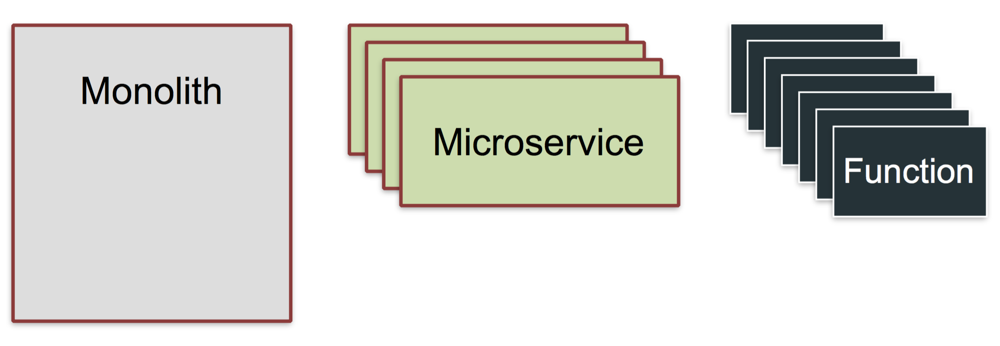

### [◀](README.md

# Setting up a FaaS platform

[](https://blog.alexellis.io/content/images/2017/08/evolution.png)


With function we mean a small and reusable piece of code that:

- is short-lived
- is not a daemon (long-running)
- is not stateful
- makes use of your existing services or third-party resources
- usually executes in a few seconds

[](https://landscape.cncf.io/category=hosted-platform,installable-platform&format=card-mode&grouping=category)

There is a reach zoology of FaaS frameworks created to provide and  to manage functions starting from the one developed by IaaS providers (e.g. AWS Lambda, Google Cloud Functions, Azure functions).
There are also many open-source FaaS solutions (as you can see in the figure above) and for this hands-on we will make use of [OpenFaaS](https://www.openfaas.com/).

## Getting things ready on Kubernetes

```bash
kubectl apply -f https://raw.githubusercontent.com/openfaas/faas-netes/master/namespaces.yml
helm repo add openfaas https://openfaas.github.io/faas-netes/
# generate a random password
PASSWORD=$(head -c 12 /dev/urandom | shasum| cut -d' ' -f1)

kubectl -n openfaas create secret generic basic-auth \
--from-literal=basic-auth-user=admin \
--from-literal=basic-auth-password="$PASSWORD"

echo $PASSWORD > gateway-password.txt
```

```bash
curl -sL cli.openfaas.com | sudo sh
```

```bash
$ faas-cli help
$ faas-cli version
```

```bash
helm repo update \
 && helm upgrade openfaas --install openfaas/openfaas \
    --namespace openfaas  \
    --set basic_auth=true \
    --set functionNamespace=openfaas-fn
```

After few minutes you should be able to go to `http://127.0.0.1:31112` to start browsing the OpenFaas WebUI.


## Homeworks


## Other references

- https://kubernetes.io/docs/tasks/tools/install-minikube/
- https://github.com/kubernetes-sigs/kind


- https://kubernetes.io/docs/concepts/overview/working-with-objects/kubernetes-objects/
- http://kubernetesbyexample.com/


### [--> NEXT: T.B.D](openfaas.md)