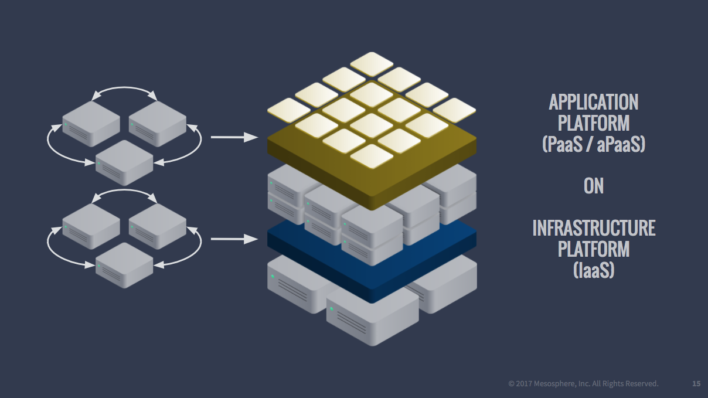
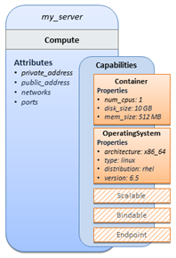

### [◀](README.md)


# Introduction to cloud platforms

When working with cloud resources, depending on the user needs, different layers of underlyng abstraction can be needed, and depending on how many layers and their composition one can define different categories.

[](https://dodas-ts.github.io/SOSC-2019/img/platform-spectrum-small.png)


## Platform as a Service on top of Infrastracture as a Service

[](https://dodas-ts.github.io/SOSC-2019/img/PaaS-IaaS.png)

Infrastructure as a service (IaaS)  is __a cloud computing offering in which a vendor provides users access to computing resources such as servers__, storage and networking. Organizations use their own platforms and applications within a service provider’s infrastructure.

Key features:

- Instead of purchasing hardware outright, users pay for IaaS on demand.
- Infrastructure is scalable depending on processing and storage needs.
- Saves enterprises the costs of buying and maintaining their own hardware.
- Because data is on the cloud, there can be no single point of failure.
- Enables the virtualization of administrative tasks, freeing up time for other work.

Platform as a service (PaaS) is __a cloud computing offering that provides users with a cloud environment in which they can develop, manage and deliver applications.__ In addition to storage and other computing resources, users are able to use a suite of prebuilt tools to develop, customize and test their own applications.

Key features:

- SaaS vendors provide users with software and applications via a subscription model.
- Users do not have to manage, install or upgrade software; SaaS providers manage this.
- Data is secure in the cloud; equipment failure does not result in loss of data.
- Use of resources can be scaled depending on service needs.
- Applications are accessible from almost any internet-connected device, from virtually anywhere in the world.

__N.B. In this hands-on a simple VM will be deployed, as an example, on cloud resources in an automated way thanks the use of a PaaS orchestrator and TOSCA system description files. More complicated recipices can provide you with a working k8s cluster where you can setup a FaaS framework as you will use in the next chapters.__


## INDIGO-DC PaaS orchestrator

[](https://dodas-ts.github.io/SOSC2019/img/sosc-indigo.png)

[The INDIGO PaaS Orchestrator](https://github.com/indigo-dc/orchestrator) allows to instantiate resources on Cloud Management Frameworks (like OpenStack and OpenNebula) platforms based on deployment requests that are expressed through templates written in [TOSCA YAML Simple Profile v1.0](https://docs.oasis-open.org/tosca/TOSCA-Simple-Profile-YAML/v1.0/csprd01/TOSCA-Simple-Profile-YAML-v1.0-csprd01.html), and deploys them on the best cloud site available.

### Requirement

- First of you need to register to the service as described [here](https://dodas-iam.cloud.cnaf.infn.it). *N.B.* please put in the registration note "SOSC2019 student". Requests without this note will not be accepted. Please also notice that the resources instantiated for the school will be removed from the test pool few days after the end of the school.
- `golang` installation is also needed [here](https://golang.org/doc/install)
```bash
# For the school machine, just do:
wget https://dl.google.com/go/go1.13.linux-amd64.tar.gz
sudo tar -C /usr/local -xzf go1.13.linux-amd64.tar.gz
export PATH=$PATH:/usr/local/go/bin:/home/ubuntu/go/bin
```

### Install orchent client

The requirement here is `golang` installation that can you find [here](https://golang.org/doc/install)

```bash
go get github.com/indigo-dc/orchent
go install github.com/indigo-dc/orchent
wget https://github.com/Cloud-PG/dodas-go-client/releases/download/v0.2.2/dodas.zip
unzip dodas.zip
sudo mv dodas /usr/local/bin/
sudo apt install -y jq unzip
```


### Retrieve IAM token

``` bash
git clone https://github.com/Cloud-PG/SOSC2019.git
cd SOSC2019
source ./scripts/get_orchent_token.sh
```

You'll be prompted with username and password requests. Just insert the one corresponding to you Indigo-IAM account.

### Using TOSCA

[](https://dodas-ts.github.io/SOSC2019/img/tosca.png)

The TOSCA metamodel uses the concept of __service templates to describe cloud workloads as a topology template__, which is a graph of node templates modeling the components a workload is made up of and as relationship templates modeling the relations between those components. TOSCA further provides a type __system of node types to describe the possible building blocks for constructing a service template__, as well as relationship type to describe possible kinds of relations. Both node and relationship types may define lifecycle operations to implement the behavior an orchestration engine can invoke when instantiating a service template. For example, a node type for some software product might provide a ‘create’ operation to handle the creation of an instance of a component at runtime, or a ‘start’ or ‘stop’ operation to handle a start or stop event triggered by an orchestration engine. Those lifecycle operations are backed by implementation artifacts such as scripts or Chef recipes that implement the actual behavior.

The TOSCA simple profile assumes a number of base types (node types and relationship types) to be supported by each compliant environment such as a ‘Compute’ node type, a ‘Network’ node type or a generic ‘Database’ node type. Furthermore, it is envisioned that a large number of __additional types for use in service templates will be defined by a community over time__. Therefore, template authors in many cases will not have to define types themselves but can __simply start writing service templates that use existing types__. In addition, the simple profile will provide means for easily customizing and extending existing types, for example by providing a customized ‘create’ script for some software.


### Deploy a simple VM on the cloud: TOSCA types

Tosca types are the building blocks needed to indicate the correct procedure for the vm creation and software deployment.

During this hands on the following types are used:

``` yaml
tosca_definitions_version: tosca_simple_yaml_1_0

capability_types:

  tosca.capabilities.indigo.OperatingSystem:
    derived_from: tosca.capabilities.OperatingSystem
    properties:
      gpu_driver:
        type: boolean
        required: no
      cuda_support:
        type: boolean
        required: no
      cuda_min_version:
        type: string
        required: no
      image:
        type: string
        required: no
      credential:
        type: tosca.datatypes.Credential
        required: no

  tosca.capabilities.indigo.Scalable:
    derived_from: tosca.capabilities.Scalable
    properties:
      min_instances:
        type: integer
        default: 1
        required: no
      max_instances:
        type: integer
        default: 1
        required: no
      count:
        type: integer
        description: the number of resources
        required: no
        default: 1
      removal_list:
        type: list
        description: list of IDs of the resources to be removed
        required: no
        entry_schema:
          type: string

  tosca.capabilities.indigo.Container:
    derived_from: tosca.capabilities.Container
    properties:
      instance_type:
        type: string
        required: no
      num_gpus:
        type: integer
        required: false
      gpu_vendor:
        type: string
        required: false
      gpu_model:
        type: string
        required: false  


  tosca.capabilities.indigo.Endpoint:
    derived_from: tosca.capabilities.Endpoint
    properties:
      dns_name:
        description: The optional name to register with DNS
        type: string
        required: false
      private_ip:
        description: Flag used to specify that this endpoint will require also a private IP although it is a public one.
        type: boolean
        required: false
        default: true
    attributes:
      credential:
        type: list
        entry_schema:
          type: tosca.datatypes.Credential


artifact_types:

  tosca.artifacts.Implementation.YAML:
    derived_from: tosca.artifacts.Implementation
    description: YAML Ansible recipe artifact
    mime_type: text/yaml
    file_ext: [ yaml, yml ]

  tosca.artifacts.AnsibleGalaxy.role:
    derived_from: tosca.artifacts.Root
    description: Ansible Galaxy role to be deployed in the target node

relationship_types:

  tosca.relationships.indigo.Manages:
    derived_from: tosca.relationships.Root

node_types:

  tosca.nodes.WebServer.Apache:
    derived_from: tosca.nodes.WebServer
    interfaces:
      Standard:
        create:
          implementation:  https://raw.githubusercontent.com/DODAS-TS/SOSC-2019/master/templates/hands-on-1/ansible-role-install.yml
        start:
          implementation:  https://raw.githubusercontent.com/DODAS-TS/SOSC-2019/master/templates/hands-on-1/ansible-role-apache.yml

  tosca.nodes.indigo.Compute:
    derived_from: tosca.nodes.indigo.MonitoredCompute
    attributes:
      private_address:
        type: list
        entry_schema:
          type: string
      public_address:
        type: list
        entry_schema:
          type: string
      ctxt_log:
        type: string
    capabilities:
      scalable:
        type: tosca.capabilities.indigo.Scalable
      os:
         type: tosca.capabilities.indigo.OperatingSystem
      endpoint:
        type: tosca.capabilities.indigo.Endpoint
      host:
        type: tosca.capabilities.indigo.Container
        valid_source_types: [tosca.nodes.SoftwareComponent]

  tosca.nodes.indigo.MonitoredCompute:
    derived_from: tosca.nodes.Compute
    properties:
      # Set the current data of the zabbix server
      # but it can also specified in the TOSCA document
      zabbix_server:
        type: string
        required: no
        default: orchestrator.cloud.cnaf.infn.it
      zabbix_server_port:
        type: tosca.datatypes.network.PortDef
        required: no
        default: 10051
      zabbix_server_metadata:
        type: string
        required: no
        default: Linux      668c875e-9a39-4dc0-a710-17c41376c1e0
    artifacts:
      zabbix_agent_role:
        file: indigo-dc.zabbix-agent
        type: tosca.artifacts.AnsibleGalaxy.role
    interfaces:
      Standard:
        configure:
          implementation: https://raw.githubusercontent.com/indigo-dc/tosca-types/master/artifacts/zabbix/zabbix_agent_install.yml
          inputs:
            zabbix_server: { get_property: [ SELF, zabbix_server ] }
            zabbix_server_port: { get_property: [ SELF, zabbix_server_port ] }
            zabbix_server_metadata: { get_property: [ SELF, zabbix_server_metadata ] }
```


### Deploy command with deployment template

The deployment template makes use of the TOSCA types defined above to create and orchestrate the deployment on the cloud resources.

``` yaml
tosca_definitions_version: tosca_simple_yaml_1_0

imports:
  - indigo_custom_types:  https://raw.githubusercontent.com/DODAS-TS/SOSC-2019/master/templates/common/types.yml

description: TOSCA template for a complete CMS Site over Mesos orchestrator

topology_template:

  inputs:

    input test:
      type: string 
      default: "test"
 
  node_templates:

    create-server-vm:
      type: tosca.nodes.indigo.Compute
      capabilities:
        endpoint:
          properties:
            network_name: PUBLIC
            dns_name: serverpublic
        scalable:
          properties:
            count: 1 
        host:
          properties:
            num_cpus: 1
            mem_size: "2 GB"
        os:
          properties:
            image: "ost://cloud.recas.ba.infn.it/1113d7e8-fc5d-43b9-8d26-61906d89d479"

  outputs:
    vm_ip:
      value: { concat: [ get_attribute: [ create-server-vm, public_address, 0 ] ] }
    cluster_credentials:
      value: { get_attribute: [ create-server-vm, endpoint, credential, 0 ] }
```

Before starting with the deployment let's validate our template:

```bash
dodas validate --template templates/hands-on-1/Handson-Part1.yaml
```

Then start the deployment on provided cloud resources with:

```bash
dodas create --config auth_file.yaml templates/hands-on-1/Handson-Part1.yaml
```

``` bash
orchent depcreate  templates/hands-on-1/Handson-Part1.yaml '{}'
```

the expected output is something like:

``` text
Using config file: auth_file.yaml
validate called
Template OK
Template: templates/hands-on-1/Handson-Part1.yaml 
Submitting request to  :  https://im-dodas.cloud.cnaf.infn.it/infrastructures
InfrastructureID:  69a25fce-d947-11e9-b18c-0242ac120003
```

Note down you InfrastructureID.

### Monitor the deployment process

Check the status of the deployment time to time with:

```bash
dodas --config auth_file.yaml get status <InfrastructureID>
```

When completed just check how many VMs are available

```bash
$ dodas --config auth_file.yaml list vms <InfrastructureID>
Using config file: auth_file.yaml
vms called
Submitting request to  :  https://im-dodas.cloud.cnaf.infn.it/infrastructures
Available Infrastructure VMs:
 https://im-dodas.cloud.cnaf.infn.it/infrastructures/69a25fce-d947-11e9-b18c-0242ac120003/vms/0
```

Now you can retrieve the vm0 details and save the private key in a file (e.g. vm0-key) :

```bash
dodas --config auth_file.yaml get vm <InfrastructureID> 0

# now write down the private key provided into vm0-key file then
chmod 600 vm0-key
```

Now you should be able to log into the machine with:

```bash
ssh -i vm0-key <public address provided above>
```


## HOMEWORKS

- Create an automatic deployment of a webserver with [Ansible](ansible.md) 
- Just to get an idea, try to take a look at the TOSCA file for the deployment of kubernetes cluster that uses INDIGO-DC PaaS Orchestrator and Ansible recipes [here](https://github.com/indigo-dc/tosca-templates/blob/k8s_cms/dodas/Kubernetes.yaml)
